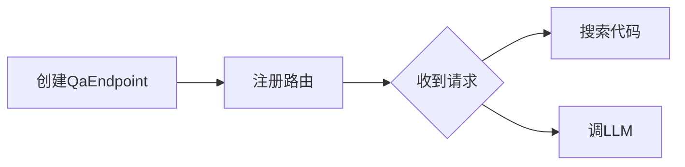
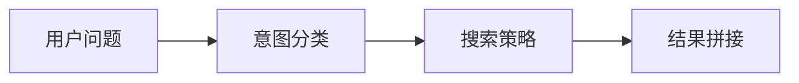

# Agent 回答质量标准

## 问题

LangGraph Agent 的回答太冗长，包含搜索过程叙述，结构松散，用户需要翻找才能找到关键信息。

## 目标

让 Agent 的回答结构清晰、结论先行、代码引用精准，像向领导汇报一样。

## 核心原则

1. **结论先行（BLUF）**：第一句话直接给出答案，包括文件路径和行号
2. **按意图定结构**：Agent 根据问题类型自动选择回答结构
3. **过程不可见**：搜索过程不暴露给用户
4. **代码片段"挑关键"**：不返回整个函数，只展示关键调用点

## 按意图的回答结构

### where-is（定位）
```
结论：`classifyDomain` 在 src/server/qa-endpoint.ts:535

签名：
```typescript
function classifyDomain(question: string): Domain
```
```

### what-is（解释）  
```
结论：`classifyDomain` 根据问题关键词分类代码问题领域（src/server/qa-endpoint.ts:535）

核心逻辑：
- 编译构建关键词 → build-issue
- 缺陷关键词 → bug-analysis
- 堆栈/崩溃关键词 → stack-analysis
- 日志关键词 → log-analysis
- 其余 → general

调用方：classifyQuestion() → createQaEndpoint()
```

### how-to（用法）
```
结论：用 `createQaEndpoint()` 创建 QA 端点（src/server/qa-endpoint.ts:745）



关键代码：
```typescript
const qaHandler = createQaEndpoint(resolveRepo, resolveLLMConfig, search, ...)
app.post('/api/qa', qaHandler)
```

参数说明：
| 参数 | 作用 |
|------|------|
| resolveRepo | 仓库路径解析 |
| resolveLLMConfig | LLM 配置 |
```

### why-error（排错）
```
根因：xxx（file.ts:line）

复现场景：
- 条件A → 触发错误
- 条件B → 正常

修复：xxx → xxx（file.ts:line）
```

### what-impact（影响分析）
```
结论：修改 `classifyDomain` 影响以下范围（src/server/qa-endpoint.ts:535）

调用者：
- classifyQuestion() → 兼容别名
- createQaEndpoint() → 每次请求调用

风险评估：⚠️ 中等 — 调用方少但影响路由逻辑

建议：修改前需通知 QA 路由维护者
```

### what-structure（架构）
```
结论：`QaResolver` 是意图分析引擎（src/server/qa-resolver.ts）



支持 6 种意图：
| 意图 | 说明 | 搜索策略 |
|------|------|---------|
| what-is | 功能解释 | 搜符号→展开定义 |
| where-is | 定位 | 精确定位 |
| how-to | 用法 | 搜符号→追踪调用链 |
| why-error | 排错 | grep 错误码→定位 |
| what-structure | 架构 | 搜类型/接口定义 |
| what-impact | 影响 | 追踪调用链 |
```

### general（通用兜底）
```
结论：一句话直接回答

要点列表：
- 点1
- 点2
- 点3
```

## 代码引用规则

1. 引用格式：`file.ts:line`，不要用反引号
2. 引用必须紧贴句子末尾
3. 每个括号内只放一个文件+一个范围
4. 每个回答最多 6 个引用
5. 搜不到如实说"未搜到"

## 实现方案

在 `agent.py` 的 system prompt 中增加回答结构指引，不修改代码逻辑。
